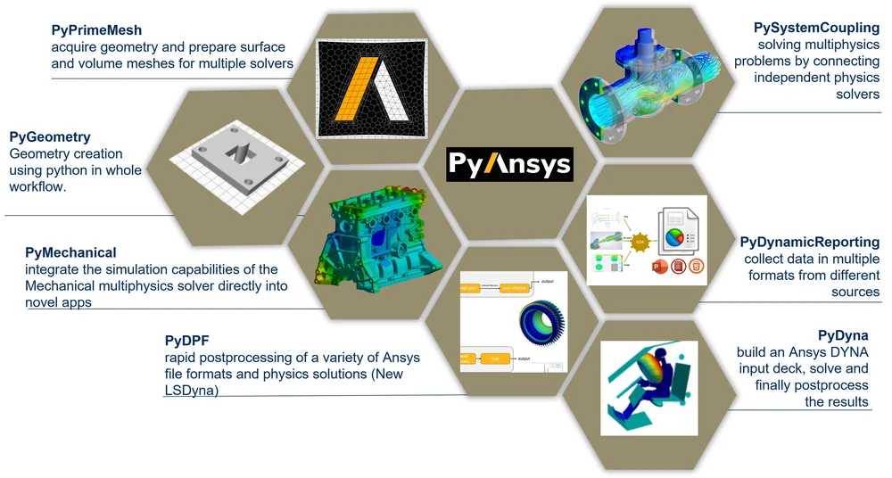

I work on **high-fidelity CAE models** focused on predicting reliability and performance of electronic products and mechanical assemblies.[file:23]

### What I Do

- Linear & non-linear structural analysis (*static, transient, modal, vibration*)  
- Thermomechanical simulations for ECUs, DC-DC converters, and e-bike components  
- Press-fit and cold weld joint evaluation at component and assembly level  
- PCB taboo zone analysis and tolerance-driven assembly studies  
- Structural integrity evaluation with geometric, contact, and material non-linearities  

### Typical Problems

- Will an ECU or converter survive combined thermal and mechanical loads over life?  
- How do press-fit and cold weld joints behave during insertion and in service?  
- Which regions of a PCB and housing are most critical for fatigue or failure?  
- How do manufacturing tolerances and assembly variation affect reliability?

### Tools & Stack

- *Ansys Workbench / Mechanical / MAPDL*  
- *LS-DYNA, Altair HyperMesh*  
- *SpaceClaim*  
- Python for pre/post-processing and scripting around simulation workflows  

